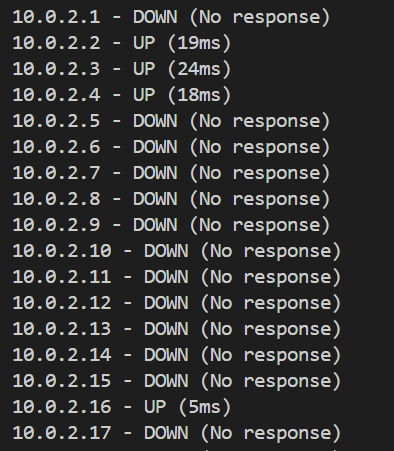

# Ip Address Scanner

## How does it work?
The script takes a network range or specific IPs and input and generates a list of IP addresses to scan. 
I used multithreading to make the proccess go alot faster and it can easily scan IPs alot faster. 
Each IP is tested to see if it is UP (Responding) or DOWN (Not Responding) or even ERROR.
Once it is done running it will give you a summary of what it scanned. How many hosts are active down or encountered errors.
### How to run the code
To run the code you simply open the terminal and put: python3 ip_freely.py -n 10.0.2.16/24

## What is the purpose?
The purpose of this IP Address Scanner is that its helpful to scan all of the IPs if your having connectivity issues or to detect unresponsive hosts or anyhting of that nature. And with the usage of the multithreading it makes this proccess alot more helpful and useful.